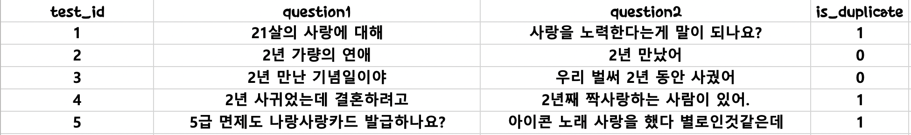

# 질문쌍(Paired Question v.2)
- 짝 지어진 두 개의 질문이 같은 질문인지 다른 질문인지 핸드 레이블을 달아둔 데이터              
- 사랑, 이별, 또는 일상과 같은 주제로 도메인 특정적이지 않음    

# 데이터 관련 이슈
데이터 생성 후 train data와 test data의 distribution이 다른 Issues로   
@aisolab님이 다시 split 한 데이터로 업데이트        

데이터 재생성 코드 참고 링크 : https://github.com/aisolab/nlp_implementation/tree/master/BERT_pairwise_text_classification

=================================     

# 질문쌍과 관련한 단상들

#  "두 질문이 같다"라는 말의 정의    
"짝 지어진 두 질문이 같다"는 말은 문장의 길이, 어순 또는 사용하는 단어가 달라졌음에도 불구하고 두 문장이 같은 의미임을 나타낸다. 즉 형태 통사적 차이에도 불구하고 의미는 같다고 판정하는 것이다.    

- 문장의 길이      
유의어, 축약어 등의 사용으로 인한 음절의 증가 또는 축소 외에 단어 변경의 결과로 생기는 모든 문장 길이의 변화를 포괄한다.    
(예) 결국 부자가 되었다 - 결국 부자가 됐다. 마침내 부자가 되고야 말았다.   

- 어순     
국어에서 부사어의 이동은 의미를 차이를 가져오지 않는 경우가 많다. 그 외에도 다양한 어순 이동이 가능하다.(정보 구조적 의미는 고려하지 않음)   
(예) 마침내 부자가 되었다. -부자가 되었다 마침내.   

- 아주 많은 경우에 동의어 또는 유의어를 사용하면 같은 문장으로 분류된다.       
(예) 결국 거지가 되었다 - 결국 걸인이 되었다. 마침내 비렁뱅이가 되었다.    

- 미묘한 문제          
1) 공손법 또는 시상, 서법에서 차이가 나는 경우 이를 다른 문장으로 볼 것인지 같은 문장으로 볼 것인지는 논의의 대상이 될 수 있다. 그렇지만 국어의 경우 자연어처리 내지 분석의 과정에서 자주 어미나 조사를 제외하는 어근화(stem) 처리를 하는데 이 경우는 명백하게 시상의 차이로 인해 문장의 의미 차이가 생기지 않는다. (예) 부자가 되었습니다. -마침내 부자가 되다.
2) 도메인의 성격이 분명한 경우는 국어의 특성상 대부분이 하나의 어미로 통일되는 데이터들이 생기게 마련이고 이러한 편이 자연스럽다고 여겨진다.
(예) 신문인 경우 '-다'(소위 절대시제)로 끝나게 될 것이고 구어라면 '-요' 등의 반말체 어미로 끝나는 문장이 압도적으로 많다. 압도적이라고 한 이유는 신문에서도 인용이면 반말이나 공손 표현이 등장하게 되고 구어에서도 마찬가지기 떄문이다. 

- 어려운 문제           
 부정 표현은 질문쌍 유사성의 난이도를 높이는 가장 큰 요인으로 작용한다. 다음의 예시는 '쉽다, 성공하다, 생각하다 +부정표현'을 어순 배열을 달리해서 문장을 생성한 경우인데 문장 의미와 의미 센서 모두에 크고 작은 차이가 생긴다.       
              
(예) 쉽게 성공했다고 생각하지 않는다.(어렵게 성공했다)            
    성공하지 않았다고 생각하기 쉽다.(성공했다)           
    쉽게 생각해도 성공한 것은 아니다(실패했다)       
    
이러한 예시가 실제 말뭉치에 자주 나타나는 것은 아니지만 정반대의 의미라는 점에서 자연어의 난제 중에 하나라고 할 수 있다.       
                           
- 기타    
띄어쓰기나 오타 등으로 인해 두 문장이 달라졌다면 이는 오류를 바로 잡아야 하는 문제이지 이 두 문장의 의미가 다르다고 판단할 수 없다.    

## Data description

kor_Pair_test.csv
kor_pair_train.csv

train  6,888 개
test 688개           

label               
같은 질문 0               
다른 질문 1                 
                       

## 

데이터 생성에 참고한 자료
https://www.kaggle.com/c/quora-insincere-questions-classification/data
